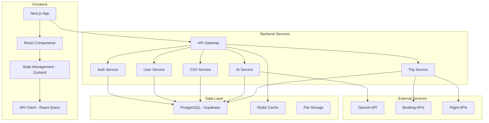
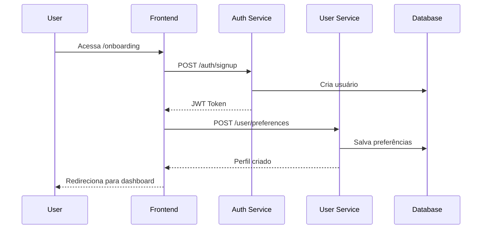
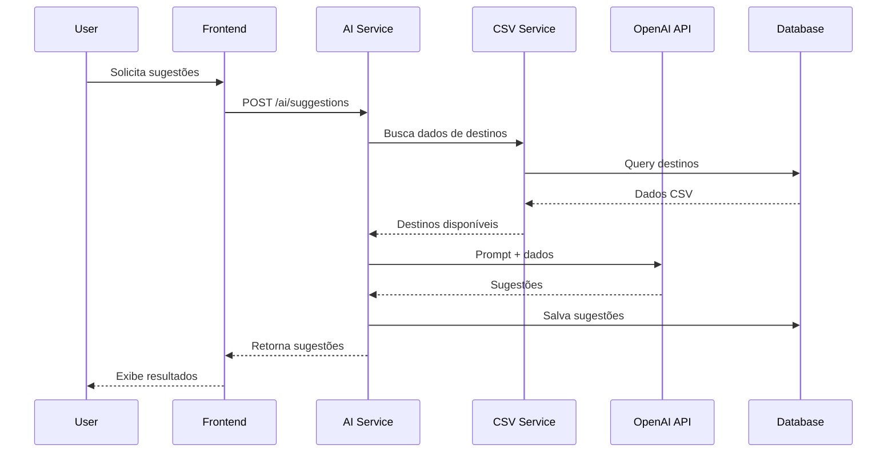

# Arquitetura do Sistema - Travel Planner

## Visão Geral da Arquitetura



## Estrutura de Diretórios

```
travel-planner-app/
├── frontend/                 # Next.js Application
│   ├── src/
│   │   ├── app/             # App Router (Next.js 14)
│   │   ├── components/      # React Components
│   │   ├── hooks/           # Custom Hooks
│   │   ├── lib/             # Utilities & Config
│   │   ├── services/        # API Services
│   │   ├── store/           # Zustand Store
│   │   └── types/           # TypeScript Types
│   ├── public/              # Static Assets
│   └── package.json
│
├── backend/                 # Node.js API
│   ├── src/
│   │   ├── controllers/     # Route Controllers
│   │   ├── middleware/      # Express Middleware
│   │   ├── models/          # Database Models
│   │   ├── routes/          # API Routes
│   │   ├── services/        # Business Logic
│   │   ├── utils/           # Utilities
│   │   └── types/           # TypeScript Types
│   ├── prisma/              # Database Schema
│   └── package.json
│
├── shared/                  # Shared Types & Utils
│   ├── types/               # Common TypeScript Types
│   └── constants/           # Shared Constants
│
├── docker/                  # Docker Configuration
│   ├── frontend.Dockerfile
│   ├── backend.Dockerfile
│   └── docker-compose.yml
│
├── docs/                    # Documentation
│   ├── api/                 # API Documentation
│   └── deployment/          # Deployment Guides
│
└── scripts/                 # Build & Deploy Scripts
    ├── setup.sh
    └── deploy.sh
```

## Fluxo de Dados

### 1. Onboarding do Usuário


### 2. Geração de Sugestões AI


## Componentes Principais

### Frontend Components
- **Layout**: Header, Footer, Navigation
- **Onboarding**: Multi-step form
- **Search**: Filters and search interface
- **Results**: Trip cards and comparison
- **Dashboard**: User profile and history
- **Admin**: CSV upload and management

### Backend Services
- **Auth Service**: JWT authentication
- **User Service**: Profile management
- **CSV Service**: File processing
- **AI Service**: OpenAI integration
- **Trip Service**: Search and booking
- **Webhook Service**: External integrations

## Segurança

### Autenticação
- JWT tokens com refresh
- Rate limiting por IP
- Validação de input
- CORS configurado

### Dados
- Criptografia de dados sensíveis
- Sanitização de uploads CSV
- Validação de schemas
- Logs de auditoria

## Performance

### Caching Strategy
- Redis para sessões
- Cache de sugestões AI
- CDN para assets estáticos
- Database query optimization

### Monitoring
- Application metrics
- Error tracking
- Performance monitoring
- Health checks
